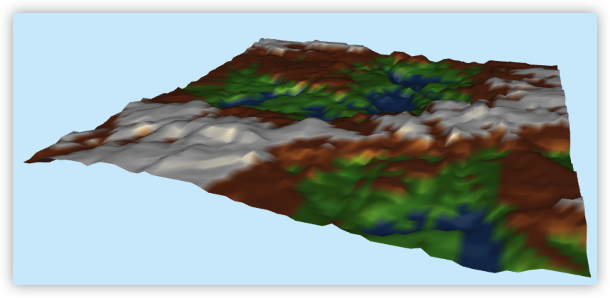

# CS418-Interactive_Computer_Graphics

## Intro
These are 5 machine problems from CS418 taken from UIUC in Spring 2022. Demo of each MP is shown below.

### MP1

### MP2

### MP3

### MP4

### MP5

### MP6

## Notice

If you are students taking CS418 with Prof. Shaffer, MAKE SURE that you write your own code. Do **NOT** copy the code here without proper citation. I am **NOT** responsible for any behaviors you conduct that violate the academic integrity regulations. 
